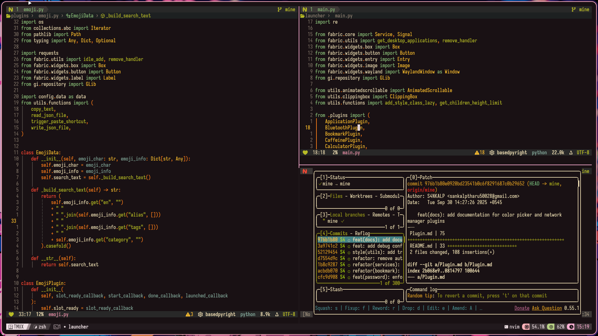

<center>

<h1>
  <a href="https://S4NKALP.github.io/keycodex">keycodex</a>
</h1>

<!-- Badges -->
<p>
  <a href="https://github.com/S4NKALP/keycodex/blob/main/LICENSE">
    
  </a>
  <a href="https://github.com/S4NKALP/keycodex/graphs/contributors">
    
  </a>
  <a href="https://github.com/S4NKALP/keycodex/stargazers">
    
  </a>
  <a href="https://github.com/S4NKALP/keycodex/network/members">
    
  </a>
  <a href="https://github.com/S4NKALP/keycodex/watchers">
    
  </a>
  <a href="https://github.com/S4NKALP/keycodex/pulse">
    
  </a>
</p>

<h3>My Personalized Dev Env ❤️👨‍💻</h3>

<!-- Screenshot -->
<figure>
  
  <figcaption>keycodex screenshot</figcaption>
</figure>

<p>Handcrafted Neovim setup for the ultimate CLI dev experience</p>

</center>

## 💻 Installation

```bash
git clone https://github.com/S4NKALP/keycodex ~/.config/nvim
```

## 🚀 Usage

### Core

Files in [lua/core](./lua/core/) control the core of neovim:

- [options](./lua/core/options.lua),
- [functions](./lua/core/functions.lua)
- [autocmds](./lua/core/autocmd.lua)

### ⌨️ Keybindings

Apart from [core/keys](./lua/core/keys.lua) most keybindings are configured using [which-key](./lua/plugins/whichkey.lua)
