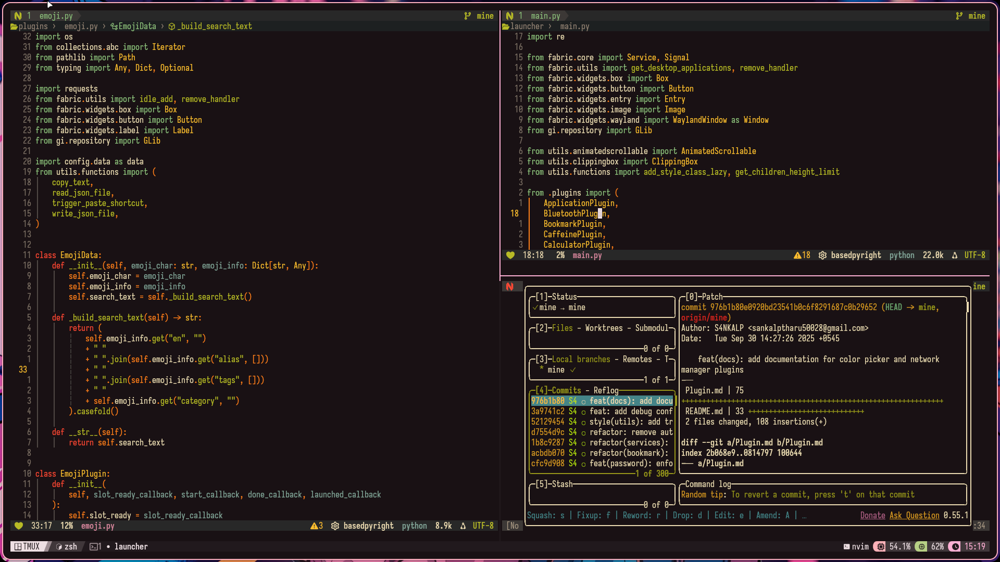

<div align="center">

<h1>
  <a href="https://S4NKALP.github.io/keycodex">KeyCodeX</a>
</h1>

<p>
  <a href="https://github.com/S4NKALP/keycodex/blob/main/LICENSE">
    
  </a>
  <a href="https://github.com/S4NKALP/keycodex/stargazers">
    
  </a>
  <a href="https://github.com/S4NKALP/keycodex/pulse">
    
  </a>
</p>

> All commit messages in this repo are AI-generated using [DevGen](https://github.com/S4NKALP/DevGen)

<h3>Handcrafted Neovim setup for the ultimate CLI development experience. ❤️👨‍💻</h3>

<figure>
  
</figure>

</div>

---

## ✨ Features

- **📦 Native Plugin Management**
  - Leverages Neovim's built-in package system for robust and fast plugin loading.
  - Interactive UI for managing plugins with  `:PackUI`.
  - Automatic detection and installation of missing plugins on startup.
  - Non-interactive cleaning of inactive plugins.

- **🚀 Powered by [Snacks.nvim](https://github.com/folke/snacks.nvim)**
  - **Dashboard**: Beautiful startup screen with quick actions.
  - **Picker**: Ultra-fast file, grep, and project fuzzy finding.
  - **Notifier**: Modern notification system with history.
  - **Scratch**: Persistent scratchpads for quick notes or code snippets.
  - **Explorer**: Integrated file explorer and rename utilities.

- **🎨 Modern UI & UX**
  - **Smart Column**: Dynamic `colorcolumn` that only appears when lines exceed limits.
  - **Aesthetic Design**: Curated color schemes and smooth animations via `Snacks.animate`.
  - **Mini Ecosystem**: Leveraging `mini.nvim` for files, icons, pairs, and more.

- **🛠️ Developer Productivity**
  - **LSP & Tree-sitter**: Fully configured with auto-installation via `:TSInstallAll`.
  - **Auto-Save**: Smart debounced auto-saving (3s) to prevent data loss.
  - **Secure Env**: Automatic masking of sensitive values in `.env` files.
  - **Auto-Directory**: Automatically creates parent directories when saving a new file.

---

## 💻 Installation

```bash
# Clone the repository to your Neovim config directory
git clone https://github.com/S4NKALP/keycodex ~/.config/nvim

# Launch Neovim - Missing plugins will install automatically!
nvim
```

---

## 📂 Project Structure

- [`init.lua`](./init.lua) - Main entry point and orchestration.
- [`lua/`](./lua/) - Core logic and system configurations.
  - [`pack_helper.lua`](./lua/pack_helper.lua) - Helper functions and `add` API for native plugins.
  - [`packui.lua`](./lua/packui.lua) - Interactive UI for the native plugin manager.
  - [`keys.lua`](./lua/keys.lua) - Base keybindings and leader configuration.
  - [`autocmd.lua`](./lua/autocmd.lua) - Smart automation (Auto-save, Smart Column, `.env` masking, Auto-install).
  - [`options.lua`](./lua/options.lua) - Global Neovim settings & performance tweaks.
  - [`lsp.lua`](./lua/lsp.lua) - Language Server Protocol & Tree-sitter setup.
- [`plugin/`](./plugin/) - Detailed plugin configurations.
  - [`snacks.lua`](./plugin/snacks.lua) - Modern UI modules (Dashboard, Picker, Notifier, Scratchpad).
  - [`whichkey.lua`](./plugin/whichkey.lua) - Interactive keyboard shortcut groupings.
  - [`mini.lua`](./plugin/mini.lua) - Mini ecosystem utilities (Files, Icons, Pairs).

---

## ⌨️ Keybindings

The **Leader Key** is mapped to `<Space>`.

| Key | Action |
| --- | --- |
| `<leader>ff` | Find Files |
| `<leader>fg` | Live Grep |
| `<leader>ee` | Explore Files (Mini) |
| `<leader>eE` | Explorer (Snacks) |
| `<leader>ps` | Open Plugin Manager (Pack) |
| `<leader>ca` | LSP Code Actions |
| `<leader>cr` | Rename Symbol |
| `<leader>wz` | Toggle Zen Mode |

*Tip: Use `<leader>` and wait for **WhichKey** to show you the full list of available commands.*

---

<div align="center">
  <p>Handcrafted with ❤️ by <a href="https://github.com/S4NKALP">Sankalp</a></p>
</div>
